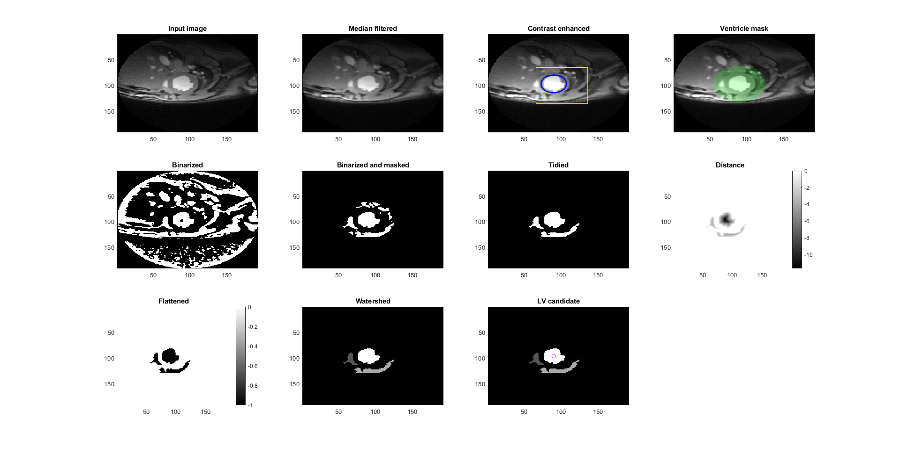
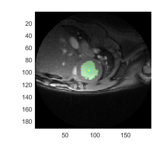
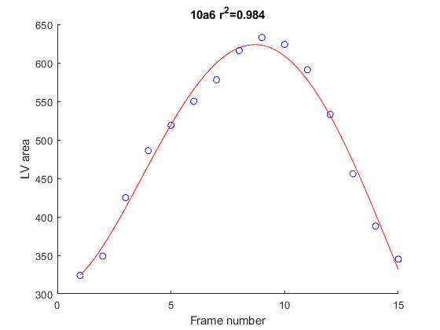
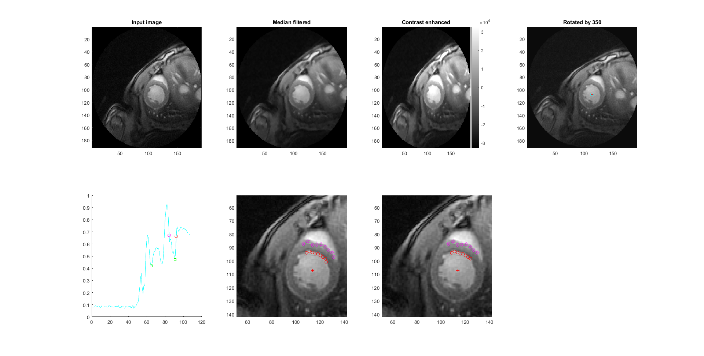
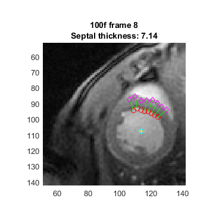

# project_CML_MRI_analysis

## Overview

This is prototype code that provides a reasonable first estimate of septal wall thickness. It does not require user-intervention once the parameters have been set up.

## Workflow

+ Pull the latest repo of [https://github.com/Campbell-Muscle-Lab/MATLAB_utilities](https://github.com/Campbell-Muscle-Lab/MATLAB_utilities)
+ Add it to your MATLAB path

### Estimate LV area for each frame in each dicom file

+ Run `<repo>/MATLAB_code/extract_lv_properties.m`

This function:
+ cycles through all of the dicom files in the designated folder
  + cycles through all the frames in each dicom
  + tries to find the LV automatically
  + saves the LV area plus a few other metrics
+ writes the data to file

### Deduce the end-diastolic frame

+ Run `<repo>/MATLAB_code/deduce_ed_frame.m`

This function:
+ fits a polynomial to the area / frame data
+ notes the frame with the largest area as the end diastolic frame
+ calculates the r_squared value for the polynomial as a metric of the reliability of the approach
+ write the data to file

### Collate the wall thickness data

+ Run `<repo>/MATLAB_code/collate_data.m`

This function:
+ Cycles through all the dicom files
+ Picks those with a reliable end diastolic frame (from the polynomial r_squared)
+ Finds the LV again
+ Uses profile analysis to estimate wall thickness data for a range of angles around the lv centroid
+ Finds the longest sequence of angles where the profile analysis worked
+ Assigns that sequence as the septum
+ Writes the data to file

